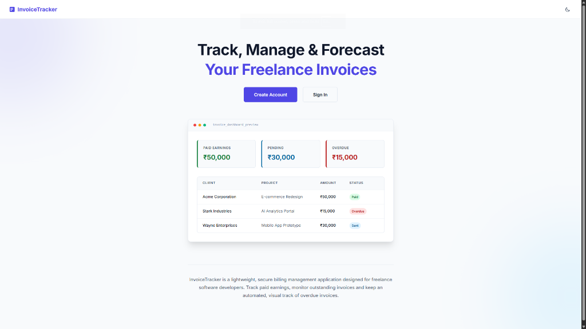
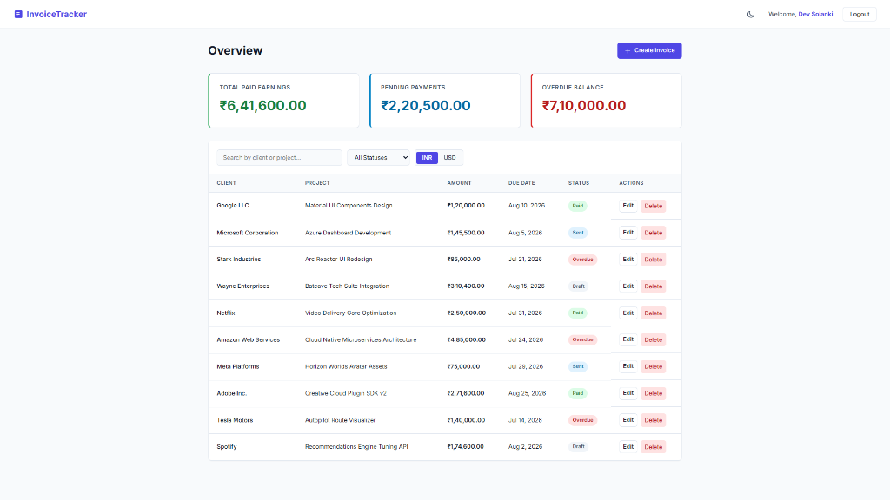

# Freelance Invoice Tracker

🚀 **Live Demo:** [https://freelance-invoice-tracker-phi.vercel.app/](https://freelance-invoice-tracker-phi.vercel.app/)

InvoiceTracker is a lightweight, secure billing management application designed for freelance software developers. It simplifies tracking paid earnings, monitoring outstanding invoices, toggling metrics between INR and USD, and dynamically identifying overdue invoices.

## Previews

### Landing Page


### User Dashboard


---

## Key Features

- **Dynamic Overview Dashboard**: Real-time summaries of Total Paid Earnings, Pending Payments, and Overdue Balances calculated automatically.
- **Intelligent Status Resolution**: Invoices that pass their due date without a `Paid` status are dynamically treated as `Overdue` in real-time.
- **Interactive Currency Switcher**: Instantly toggle view metrics and invoice values between **INR (₹)** and **USD ($)** in filters and forms.
- **Currency-Aware Sorting**: Sort invoices dynamically by Created Date (Newest/Oldest), Due Date, Amount (correctly converting currencies for proper ranking), or Status Priority.
- **Frictionless Demo Mode**: Try the application instantly with a single click from the Landing page, which automatically creates a unique guest session populated with 50 mock invoices.
- **Seamless Invoice Management**: Full CRUD interface to draft, send, view, and delete invoices.
- **Robust Security & Validation**: Google OAuth integration, JWT session management, Bcrypt password hashing, and Joi data schema validations.
- **API Security Best Practices**: Configured with Helmet HTTP response headers, CORS policies, and API request rate-limiting.

---

## Tech Stack

### Frontend
- **Framework**: React.js with React Router (Vite build system)
- **Styling**: Modern, responsive CSS with light/dark theme variables
- **Data Fetching**: Axios

### Backend
- **Framework**: Node.js & Express.js
- **Database**: MongoDB with Mongoose ODM
- **Authentication**: JWT (JSON Web Tokens) & Google OAuth (Google Sign-In)
- **Security**: Helmet, CORS, and Express-Rate-Limit

---

## Workspace Structure

This project uses a monorepo structure separating frontend clients and backend APIs:

```
├── /backend              # Node.js + Express API server, MongoDB models
│   ├── /controllers      # Route controller functions
│   ├── /models           # Database schemas (User, Invoice)
│   ├── /middleware       # Auth and error middleware
│   └── .env.example      # Backend environment variables template
│
├── /frontend             # React web application
│   ├── /src/components   # Shared UI components (Navbar, etc.)
│   ├── /src/context      # Auth context session management
│   ├── /src/pages        # Pages (Landing, Login, Dashboard, InvoiceForm)
│   └── /src/styles       # Custom CSS system
│
├── vercel.json           # Vercel Services configuration for unified monorepo hosting
└── package.json          # Root scripts to orchestrate local development
```

---

## Setup & Running Locally

### Prerequisites
- [Node.js](https://nodejs.org/) installed (v16+ recommended).
- [MongoDB](https://www.mongodb.com/) running locally or a MongoDB Atlas cloud connection string.

### 1. Installation
Install all root, backend, and frontend dependencies by running a single command in the workspace root directory:
```bash
npm run install:all
```

### 2. Environment Variables Configuration

#### Backend Setup
Go to the `/backend` directory, duplicate `.env.example`, and rename it to `.env`:
```bash
cp backend/.env.example backend/.env
```
Open `/backend/.env` and update the values with your credentials (including Google OAuth Client ID):
```env
PORT=5000
MONGO_URI=your_mongodb_connection_uri
JWT_SECRET=your_jwt_secret_key
JWT_LIFETIME=30d
GOOGLE_CLIENT_ID=your_google_client_id_here
```

#### Frontend Setup
Go to the `/frontend` directory, duplicate `.env.example`, and rename it to `.env`:
```bash
cp frontend/.env.example frontend/.env
```
Open `/frontend/.env` and update the Google Client ID:
```env
VITE_GOOGLE_CLIENT_ID=your_google_client_id_here
```

### 3. Google OAuth Configuration Setup
To configure Google Sign-In for the application:
1. Go to the [Google Cloud Console](https://console.cloud.google.com/).
2. Create a new project.
3. Configure the **OAuth Consent Screen** (User Type: External) and add the necessary user support / contact details.
4. Go to **Credentials**, click **Create Credentials**, and select **OAuth Client ID**.
5. Set the application type to **Web application**.
6. Under **Authorized JavaScript origins**, add:
   - `http://localhost:3000` (for local development)
   - Your production application URL (e.g., `https://freelance-invoice-tracker-phi.vercel.app`)
7. Click **Create** and copy the generated **Client ID**.
8. Paste this Client ID as the value for `GOOGLE_CLIENT_ID` in `backend/.env` and `VITE_GOOGLE_CLIENT_ID` in `frontend/.env`.

### 4. Running the Project
To run both the backend server and frontend development client concurrently, run the following command in the project root:
```bash
npm run dev
```
- The **Frontend** client will be served at: `http://localhost:3000`
- The **Backend** server will run at: `http://localhost:5000`

---

## Deployment (Vercel Services)

This project is configured for serverless deployment on Vercel as a single application with multiple services defined in [vercel.json](file:///c:/Users/DEV/Documents/Coding/Practice/Freelance-Invoice-Tracker/vercel.json):
* **Frontend**: Built and served as a Vite single-page application at the root (`/`).
* **Backend**: Served as a serverless Express service under `/api/(.*)`.

---

## Core API Endpoints

### Authentication
- `POST /api/v1/auth/register` - Register a new account
- `POST /api/v1/auth/login` - Login to an existing account
- `POST /api/v1/auth/demo` - Initialize a guest demo account with 50 pre-populated invoices
- `POST /api/v1/auth/google` - Login or register using a Google ID token

### Invoices
- `GET /api/v1/invoices` - Fetch all invoices for the authenticated user (supports search filters)
- `POST /api/v1/invoices` - Create a new invoice
- `GET /api/v1/invoices/:id` - Get specific invoice details
- `PATCH /api/v1/invoices/:id` - Update an existing invoice
- `DELETE /api/v1/invoices/:id` - Delete an invoice
